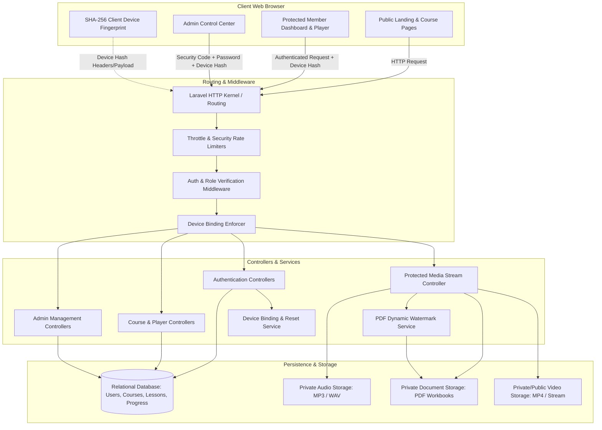
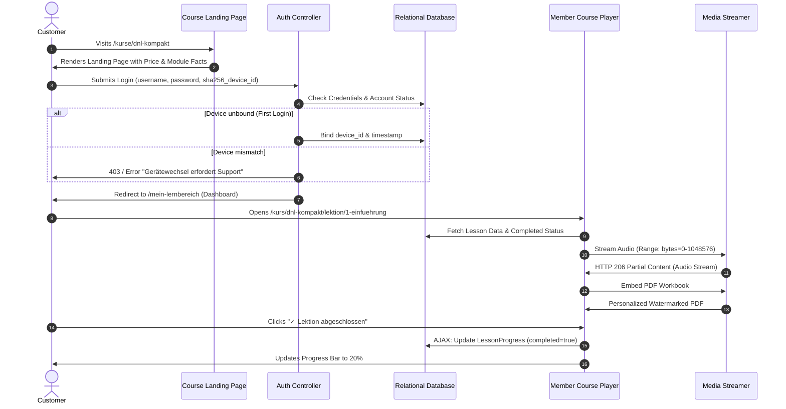
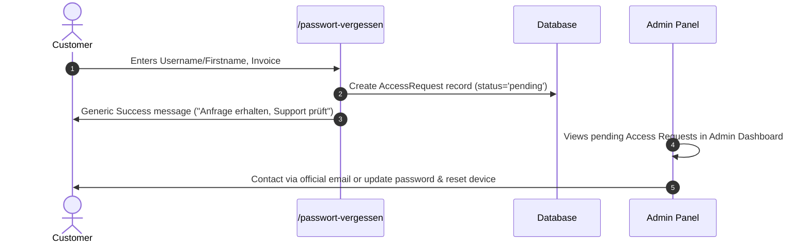
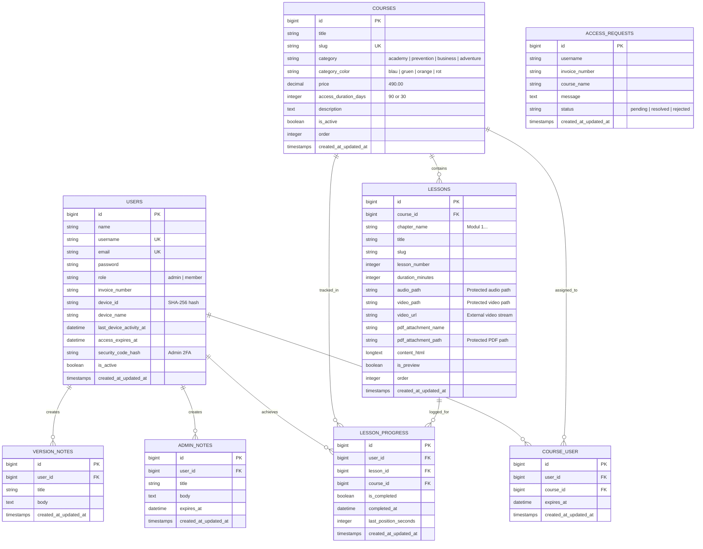

# Architecture, System Design & Workflow Specification
**Dennis Besseler Course Portal & Learning Management Platform**
*Version: 1.0.0 (Phase 1 Final & Phase 2 Ready)*

---

## 1. Executive Summary & Core Philosophy

The **Dennis Besseler Course Portal** is a high-security, full-stack Laravel learning management and delivery system designed around a strict commercial and architectural philosophy:

1. **Clean Separation of Concerns**: Complete decoupling between public sales/marketing presentation (on `besseler.de`) and the dedicated, protected learning execution environment (`besseler-kursportal.de`).
2. **Audio-First Course Pedagogy**: Tailored specifically for executive and personal development courses focusing on high-retention audio lectures, guided reflection, and embedded PDF workbooks without visual clutter.
3. **Strict Intellectual Property Protection**: Zero direct download links for course materials, dynamic server-side license watermarking, cryptographic single-device binding, and protected media streaming via authenticated HTTP range requests.
4. **Transparent, Single-Payment Model**: No recurring subscriptions, no third-party payment gateway cookies or trackers on the portal, and deterministic course access durations.

---

## 2. High-Level Software Architecture

The platform follows a layered **Model-View-Controller (MVC) + Service Layer Architecture** built on Laravel, utilizing PHP 8.2+, SQLite/MySQL, Blade templating, and vanilla JavaScript (zero heavy SPA frameworks to ensure high performance and maximum stability).



---

## 3. Core Architectural Subsystems

### 3.1. Authentication & Single-Device Binding Engine

To protect against credential sharing and unauthorized account proliferation, the platform implements a **Cryptographic Single-Device Binding Mechanism**:

1. **Fingerprint Generation**: Upon accessing any login form, a client-side JavaScript routine gathers hardware and browser characteristics (`navigator.userAgent`, `platform`, `screen.width`, `screen.height`, `Intl.timezone`) and computes a **SHA-256 cryptographic hash** (`device_id`).
2. **First-Login Dynamic Binding**: When a customer logs in for the first time, if `device_id` is null on their record, the system automatically binds the hash to their account and timestamps `last_device_activity_at`.
3. **Subsequent Access Verification**: On all subsequent login attempts, the system validates the incoming device hash against the stored hash. If there is a mismatch:
   - Login is denied with an explicit German security notice.
   - The user is directed to the personal support channel.
4. **Admin Dynamic Device Binding & 2FA Security Code**:
   - The admin login requires an email/password **plus** a separate hashed **Security Code** (default `1979`).
   - The admin account also binds to a single administrator workstation.
5. **Administrative Device Reset**: Admins can reset a user's bound device with a single click in the Admin Panel whenever a legitimate customer changes hardware.

---

### 3.2. Protected Media Delivery & Dynamic Watermarking

All course files (Audio MP3s, Video MP4s, and PDF Workbooks) reside in non-public storage directories (`storage/app/public/audio/`, `storage/app/private/materials/`, etc.) and are never exposed via raw static web URLs.

```
Request: /kurs/{courseSlug}/lektion/{lessonSlug}/media?type=audio
  │
  ├── 1. Check Authentication (Member or Admin)
  ├── 2. Check Course Enrollment & Active Expiration Date
  ├── 3. Determine MIME Type & File Size
  ├── 4. Audio/Video -> Handle HTTP 206 Partial Content (Byte Range Requests)
  └── 5. PDF -> Pass through PdfWatermarkService -> Inject Personalized Stamp -> Output inline
```

#### Media Delivery Characteristics:
* **Audio Seeking Support**: Implements `HTTP/1.1 206 Partial Content` with `Accept-Ranges: bytes` and `Content-Range` headers, allowing instant audio seeking, jumping ±10s, and speed variations without re-downloading entire files.
* **In-Page PDF Embedding & Watermarking**:
  - PDFs are served with `Content-Disposition: inline` and viewer parameters `#toolbar=0&navpanes=0`.
  - Dynamic user stamp: `PRIVAT-LIZENZ · [First Name] · [Invoice Number RE-XXXX]` is watermarked on the fly.
  - Direct download buttons and external tab triggers are suppressed to enforce within-portal consumption.

---

### 3.3. Course Delivery & Interactive Player Architecture

The course player (`player.blade.php`) handles audio-first, video-supported, and document-backed lesson workflows:

* **Audio-First Interface**:
  - Real-time animated waveform visualizer synchronized with playback state.
  - Quick-action buttons: `↺ 10s zurück` and `↻ 10s vor`.
  - Native playback speed toggles: `1.0x`, `1.25x`, `1.5x`.
* **State Persistence (AJAX Progress Tracking)**:
  - When a student completes a lesson, clicking `✓ Lektion abgeschlossen` triggers an asynchronous `POST /kurs/{courseSlug}/lektion/{lessonSlug}/toggle-complete`.
  - The database records `is_completed = true` and `completed_at = now()`.
  - The UI updates both the main button, sidebar status indicator, and overall course progress percentage pill without requiring a full page refresh.

---

## 4. User Workflows & System Interaction

### 4.1. Customer / Student Lifecycle Flow



---

### 4.2. Administrator Management Workflow

```mermaid
sequenceDiagram
    autonumber
    actor Admin
    participant AdminAuth as Admin Login (/admin/login)
    participant AdminDash as Admin Dashboard (/admin/dashboard)
    participant DB as Database

    Admin->>AdminAuth: Enters Email, Password, Security Code ("1979")
    AdminAuth->>DB: Verify Admin Password & Security Code Hash
    AdminAuth->>Admin: Redirect to Admin Dashboard
    
    rect rgb(20, 30, 50)
        Note over Admin, AdminDash: Customer Management Actions
        Admin->>AdminDash: Add New Customer (Invoice #, Name, Username, Expiration Date)
        AdminDash->>DB: Insert User & Enroll in Selected Courses
        Admin->>AdminDash: Reset Customer Device Binding
        AdminDash->>DB: Set device_id = NULL
        Admin->>AdminDash: Reset Customer Progress
        AdminDash->>DB: Delete LessonProgress entries
    end

    rect rgb(30, 40, 60)
        Note over Admin, AdminDash: Course & Curriculum Management
        Admin->>AdminDash: Create/Edit Course & Lessons (Upload Audio/PDF, Set Duration)
        AdminDash->>DB: Save Course & Lesson Entities
        Admin->>AdminDash: Manage Admin Notes & Version Roadmap Notes
        AdminDash->>DB: Save Notes with Expiration Timers
    end
```



---

### 4.3. Forgotten Password & Access Request Workflow

In accordance with strict privacy principles (no automated plaintext passwords or automatic account disclosure):



---

## 5. Database Schema & Data Modeling

The database schema is organized into normalized relational tables:



---

## 6. Directory Structure & File Map

```
dennisaber-fullstack/
├── app/
│   ├── Http/
│   │   ├── Controllers/
│   │   │   ├── Admin/
│   │   │   │   ├── AuthController.php       # Admin login (2FA Security Code + Device)
│   │   │   │   ├── DashboardController.php  # Admin stats, notes, access requests
│   │   │   │   ├── CustomerController.php   # Customer CRUD, device reset, progress reset
│   │   │   │   ├── CourseController.php     # Course CRUD
│   │   │   │   └── LessonController.php     # Lesson CRUD, media management
│   │   │   └── Frontend/
│   │   │       ├── AuthController.php       # Customer login with device binding
│   │   │       ├── CourseController.php     # Public landing & member course player
│   │   │       ├── DashboardController.php  # Member learning area dashboard
│   │   │       ├── MediaController.php      # Range media streaming & PDF delivery
│   │   │       └── PageController.php       # Legal, payment, and support pages
│   │   └── Middleware/
│   │       ├── AdminMiddleware.php          # Guards /admin routes
│   │       └── MemberMiddleware.php         # Guards /mein-lernbereich & /kurs/*
│   ├── Models/
│   │   ├── User.php                         # User model with device attributes
│   │   ├── Course.php                       # Course entity & relationships
│   │   ├── Lesson.php                       # Lesson entity & media paths
│   │   ├── LessonProgress.php               # Student completion tracker
│   │   ├── AccessRequest.php                # Password request log
│   │   ├── AdminNote.php                    # Expirable admin reminders
│   │   └── VersionNote.php                  # Phase roadmap changelog
│   └── Services/
│       └── PdfWatermarkService.php          # Dynamic license watermark injection
├── database/
│   ├── migrations/                          # Normalized database schema migrations
│   └── seeders/
│       └── DatabaseSeeder.php               # Flagship audio courses & demo data
├── resources/
│   └── views/
│       ├── admin/                           # Admin Panel Blade Views
│       │   ├── auth/login.blade.php
│       │   ├── dashboard/index.blade.php
│       │   ├── customers/index.blade.php, create.blade.php, edit.blade.php
│       │   ├── courses/index.blade.php, create.blade.php, edit.blade.php
│       │   └── lessons/create.blade.php, edit.blade.php
│       └── frontend/                        # Public & Member Blade Views
│           ├── layouts/app.blade.php
│           └── pages/
│               ├── home.blade.php           # Portal Overview (11 courses)
│               ├── copy-protection.blade.php# Interactive Kopierschutz preview
│               ├── payment.blade.php        # Payment instructions & IBAN/QR
│               ├── faster-processing.blade.php# Payment receipt mailto generator
│               ├── auth/login.blade.php, forget-password.blade.php
│               ├── member/dashboard.blade.php# Enrolled courses & progress
│               └── course/
│                   ├── player.blade.php     # Audio-first interactive player
│                   ├── compact.blade.php, advanced.blade.php, premium.blade.php
│                   ├── stress-resources.blade.php, smoke‑free.blade.php
│                   ├── nutrition.blade.php, make-decision.blade.php
│                   ├── successful‑startup.blade.php, press-public.blade.php
│                   ├── rhetoric-under-pressure.blade.php, rio-negro.blade.php
├── tests/
│   └── Feature/
│       └── DennisCoursePortalTest.php       # 12 automated feature test suites
└── routes/
    ├── web.php                              # Public, Member, Media & Admin routes
    └── console.php                          # Artisan schedule & CLI tasks
```

---

## 7. Security, Privacy & Compliance (DSGVO / GDPR)

* **Data Minimization (Datenminimierung)**:
  - Kurskonto accounts require only a username and invoice number. No unnecessary third-party cookies or tracker scripts are loaded.
  - Payment details (credit cards, bank logins) are never stored on the portal platform.
* **Dynamic License Identification**:
  - Embedded workbooks display customer license watermarks (`PRIVAT-LIZENZ · [First Name] · [RE-Number]`) to deter document leakage without exposing home addresses or banking details.
* **Single-Device Protection**:
  - SHA-256 client fingerprinting prevents illegal credential redistribution.
* **Authenticated Stream Authorization**:
  - Any direct attempt to load audio/video/PDF files without active session token and course enrollment returns `403 Forbidden` or `404 Not Found`.

---

## 8. Verification & Test Suite

The entire architectural specification is validated by an automated test suite executed via `php artisan test`:

| Test Suite | Assertions | Purpose |
|---|---|---|
| `public landing pages are accessible` | 15 | Verifies all 11 course pages, home, and legal pages render with status 200 |
| `admin login with security code and device binding` | 8 | Validates admin credential check, security code verification, and session regeneration |
| `admin can change password with security code` | 6 | Validates admin password updates requiring both current password and 2FA code |
| `admin customer crud and device reset` | 10 | Validates customer creation, editing, deletion, device unbinding, and progress reset |
| `customer login and course player flow` | 12 | Tests student login, device binding, dashboard rendering, player access, and AJAX toggle |
| `unauthenticated media access is forbidden` | 4 | Verifies protected media route returns 403/redirect for unauthenticated requests |
| `forgot password access request is recorded` | 4 | Verifies password recovery requests are safely logged in the database |
| `inquiry mailto generator` | 4 | Tests faster-processing service page and mailto query generator |
| `admin can create update and delete lesson` | 4 | Tests full curriculum management cycle for course lessons |
| `admin can create update and delete course` | 4 | Tests course lifecycle management in the administration portal |

**Total Test Coverage:** 12 Tests, 71 Assertions, 0 Failures.
